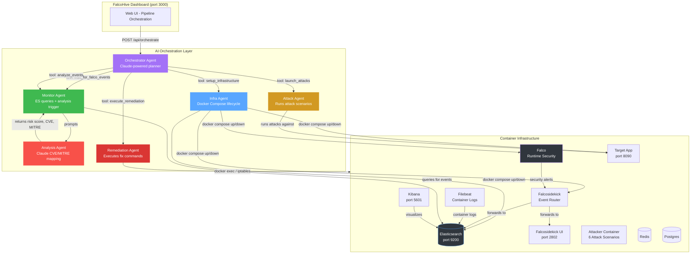

# FalcoHive

**AI-Powered Container Security Attack Lab & Orchestration Platform**

FalcoHive is an autonomous container security laboratory that combines **Falco** (runtime security), **Elasticsearch**, and **Claude AI** to create a complete security attack-detection-analysis-remediation pipeline. It simulates real container security attacks, detects them with Falco, analyzes the findings with Claude AI (CVE/MITRE mapping, risk scoring), and provides actionable remediation steps — all controllable from a single dashboard.

---

## System Architecture



### Architecture Flow

| Step | Component | What It Does |
|------|-----------|--------------|
| 1 | **Orchestrator Agent** | Claude-powered planner that receives pipeline goals and calls sub-agents via tool calling. Decides the sequence of operations. |
| 2 | **Infra Agent** | Manages Docker Compose lifecycle — builds images, starts/stops services, waits for Elasticsearch and Kibana readiness. Idempotent (skips already-running services). |
| 3 | **Attack Agent** | Builds and runs the attacker container which executes 6 container security attack scenarios against the target app. |
| 4 | **Monitor Agent** | Polls Elasticsearch for Falco security events. Once events are detected, triggers AI analysis on all events (parallelized with concurrency control). |
| 5 | **Analysis Agent** | For each event, calls Claude AI to map it to CVEs, MITRE ATT&CK techniques, calculate risk scores (1-10), and generate remediation steps. |
| 6 | **Remediation Agent** | Executes remediation commands (docker exec, iptables, sysctl) on the infrastructure to fix detected vulnerabilities. |
| 7 | **Falco + Falcosidekick** | Falco monitors syscalls and container behavior. Falcosidekick routes all alerts to Elasticsearch and the Sidekick UI. |
| 8 | **Elasticsearch + Kibana** | All events, analyses, remediations, and orchestration logs are stored in Elasticsearch. Kibana provides ad-hoc exploration. |

---

## Tech Stack

| Layer | Technology |
|-------|-----------|
| **Runtime Security** | Falco 0.36.1 (8 custom rules) |
| **Event Routing** | Falcosidekick 2.28.0 |
| **Storage & Search** | Elasticsearch 8.11.0 |
| **Visualization** | Kibana 8.11.0 |
| **Container Logs** | Filebeat 8.11.0 |
| **AI Orchestration** | Anthropic Claude Sonnet 4 (`claude-sonnet-4-20250514`) |
| **Backend API** | Python 3.12 + FastAPI |
| **Frontend** | Vanilla HTML/CSS/JS |
| **Container Runtime** | Docker + Docker Compose v2 |
| **Target App** | Python HTTP server with live visual mock application + attack impact dashboard |
| **Attacker** | Python (6 attack scenarios using scapy, ctypes, etc.) |

---

## Prerequisites

You need only a computer with **Git** installed. Everything else is handled by the setup below.

### Windows
1. Install [Git for Windows](https://git-scm.com/download/win)
2. Install [Docker Desktop for Windows](https://docs.docker.com/desktop/install/windows-install/)
   - During installation, ensure **"Use WSL 2 instead of Hyper-V"** is checked
   - After install, open Docker Desktop and wait for the engine to start (whale icon in system tray stops animating)
3. Install [WSL 2](https://learn.microsoft.com/en-us/windows/wsl/install) (if not already installed):
   ```powershell
   wsl --install
   ```
   Restart your computer after this completes.

### macOS
1. Install [Git](https://git-scm.com/download/mac) or run `xcode-select --install`
2. Install [Docker Desktop for Mac](https://docs.docker.com/desktop/install/mac-install/)

### Linux (Ubuntu/Debian)
```bash
sudo apt update
sudo apt install -y git curl
curl -fsSL https://get.docker.com | sudo sh
sudo usermod -aG docker $USER
# Log out and back in for group changes to take effect
```

---

## Setup Instructions

Follow these steps **in order**. Every step is required.

### Step 1: Clone the Repository

Open a terminal (Command Prompt on Windows, Terminal on Mac/Linux) and run:

```bash
git clone https://github.com/ritvikindupuri/falcosecurity.git
cd falcosecurity
```

### Step 2: Configure Environment

Create a `.env` file in the project root by copying the template:

```bash
# On Windows (PowerShell):
Copy-Item .env.example .env

# On Mac/Linux:
cp .env.example .env
```

> **Note:** If `.env.example` does not exist, create `.env` manually with this content:
> ```
> COMPOSE_PROJECT_NAME=falcohive-lab
> ELASTIC_VERSION=8.11.0
> FALCO_VERSION=0.36.1
> FALCOSIDEKICK_VERSION=2.28.0
> CLAUDE_API_KEY=your-claude-api-key-here
> CLAUDE_MODEL=claude-sonnet-4-20250514
> ```

Now open `.env` in a text editor and **replace `your-claude-api-key-here`** with your actual Anthropic Claude API key.

**To get a Claude API key:**
1. Go to https://console.anthropic.com/
2. Sign up or log in
3. Go to API Keys section
4. Click "Create Key"
5. Copy the key (starts with `sk-ant-`)
6. Paste it into the `.env` file replacing `your-claude-api-key-here`

### Step 3: Start the Lab

The startup script supports **two modes** — choose the one that fits what you want to do:

---

#### Mode A — Standard Mode (No AI, No Claude API Key Needed)

```bash
# On Windows (PowerShell):
.\run.sh

# On Mac/Linux:
./run.sh
```

**What this does:**
1. Builds all Docker images (target app, attacker, AI agent)
2. Starts Elasticsearch, Kibana, Falco, Falcosidekick, Falcosidekick UI, Redis, Postgres, target app, and the AI agent
3. Waits for Elasticsearch to become healthy (green/yellow status)
4. Waits for Kibana to be ready
5. Waits for the AI Agent to be responsive
6. Runs the attacker container (executes 6 attack scenarios)
7. Outputs URLs for the dashboard and services

**Key points:**
- **Zero Claude API usage** — no API key needed, no AI calls made
- All 6 attacks run automatically and hit the target app live
- Falco detects each attack and sends events to Elasticsearch
- Open http://localhost:8090 during the attack run to watch each attack compromise the target app's service cards in **real-time** (auto-refreshes every 1.5 seconds)
- After attacks finish, explore the Falco events in the dashboard at http://localhost:3000

#### Mode B — AI Mode (Claude-Powered Orchestration)

```bash
./run.sh ai
```

**What this does (same infra setup + AI pipeline):**
1. Same infrastructure setup as Mode A (steps 1-5)
2. Triggers the Claude-powered orchestration pipeline via `POST /api/orchestrate`
3. Claude AI orchestrates the full pipeline:
   - `setup_infrastructure` — checks all services (Falco etc. must already be running from host)
   - `launch_attacks` — runs all 6 attack scenarios
   - `wait_for_falco_events` — polls Elasticsearch for detections
   - `analyze_events` — runs each event through Claude for CVE/MITRE mapping and risk scoring
   - `get_analysis_results` / `execute_remediation` — reviews and fixes findings
4. Watch the pipeline progress live at http://localhost:3000

**Key points:**
- **Claude API is required** — set `CLAUDE_API_KEY` in `.env`
- You can also trigger the same pipeline by clicking **"Run Full Pipeline"** on the dashboard after running `./run.sh` from the host first
- During the attack phase, open http://localhost:8090 to see the live attack impact on the visual enterprise app dashboard

---

> **Live Attack Feed on the Target App:**
> When the attacker runs (in either mode), open http://localhost:8090 in your browser. The page auto-refreshes every 1.5 seconds and shows a **live mock enterprise application** being attacked in real-time:
>
> | Attack | What it does | You'll see on the Target App |
> |--------|-------------|---------------------------|
> | 1 — Cgroup Escape (CVE-2022-0492) | Steals credentials via container escape | **Database Config** card → `COMPROMISED` (red), timeline: "CREDENTIALS EXPOSED" |
> | 2 — OverlayFS Tamper (CVE-2021-31433) | Hides malicious files | **Internal API** card → `COMPROMISED` (red), timeline: "DATA EXFILTRATED" |
> | 3 — io_uring Bypass (CVE-2022-25362) | Privilege escalation via seccomp bypass | **Admin Portal** card → `COMPROMISED` (red), timeline: "UNAUTHORIZED ACCESS" |
> | 4 — ARP Spoof | MITM credential interception | **User Login** card → `COMPROMISED` (red), timeline: "CREDENTIALS CAPTURED" |
> | 5 — BPF Rootkit | Kernel-level persistence | **Internal API** card → `COMPROMISED` (red), timeline: "DATA EXFILTRATED" |
> | 6 — Userfaultfd (CVE-2022-2588) | Memory corruption race condition | **File Upload** card → `COMPROMISED` (red), timeline: "FILES CORRUPTED" |
>
> Each attack has three phases (PROBE → EXPLOIT → VERIFY) visible in the **Attack Timeline** feed. Service cards transition from green (OK) → yellow (probing) → red (compromised). The header banner flips from "OPERATIONAL" to "UNDER ATTACK" to "COMPROMISED".

> **Important — Order of Operations:**
> 1. **First**, run `./run.sh` from the **host terminal** — this starts Falco and all infrastructure using correct host filesystem paths
> 2. **Then**, click **"Run Full Pipeline"** on the dashboard to trigger the AI orchestration
>
> Falco, Falcosidekick, and Filebeat require host bind mounts (`./falco/falco.yaml`, etc.) and **cannot** be started from inside the ai-agent container. They must be started from the host via `./run.sh` or `docker compose up -d`. The AI pipeline's `setup_infrastructure` step only starts services that don't need host bind mounts (Elasticsearch, Kibana, Redis, etc.).

> **Note:** Before and between pipeline runs, all services are empty:
> - **Target App** (port 8090) — shows all-green service cards with "No attacks detected"
> - **Falco** — running but has no attack events to detect
> - **Elasticsearch / Kibana** — zero security events indexed
> - **Dashboard** (port 3000) — only shows "Run Full Pipeline" and "Clear Session" buttons
>
> Clicking **"Run Full Pipeline"** (or the "Clear Session" button) automatically wipes everything:
> 1. Resets the **Target App** — cards revert to green, timeline clears
> 2. Deletes all **Elasticsearch indices** — Falco events, analyses, remediations all removed
> 3. Resets the **Dashboard** — hides all stats, events, and analysis cards
>
> Then the pipeline begins fresh: attacker runs → Falco detects → events land in clean ES → target app populates in real-time. This ensures you see the complete lifecycle from a true zero-data state every time.
>
> **No synthetic or mock Falco events** are ever generated. All security events come from real Falco syscall detections only.
>
> **First run takes 5-10 minutes** as it downloads Docker images (Elasticsearch, Falco, etc.) and builds custom images. Subsequent runs are faster.

### Step 4: Access the Dashboard

Open your web browser and go to:

```
http://localhost:3000
```

You should see the **FalcoHive** dashboard with:
- The pipeline flow visualization (6 phases)
- A **"Run Full Pipeline"** button
- A **"Clear Session"** button
- A **Quick Access** toolbar with one-click links to all services:
  - **FalcoHive Dashboard** (highlighted blue — you're here)
  - **Falco UI** (port 2802 — real-time alert viewer)
  - **Kibana** (port 5601 — data exploration)
  - **Elasticsearch** (port 9200 — raw API)
   - **Target App** (port 8090 — live visual attack impact dashboard — see below)

   > **About the Target App:** This is a live **mock enterprise application** ("TargetCorp Internal Portal") that visually demonstrates how each attack compromises different parts of the system. Open http://localhost:8090 to see:
   > - **6 Service Cards** — Database Config, Admin Portal, User Login, Internal API, File Upload, System Health
   > - **Real-time color transitions** — green (OK) → yellow (probing) → red (compromised)
   > - **Attack Timeline feed** — scrolling log of every PROBE/EXPLOIT/VERIFY event with detailed impact descriptions
   > - **Dynamic header banner** — switches from "OPERATIONAL" to "UNDER ATTACK" to "COMPROMISED"
   > - **Detailed request table** — shows every HTTP request with CVE/MITRE tags and phase badges
   >
   > **API Endpoints (what the attacker targets):**
   > | Endpoint | Method | Purpose |
   > |----------|--------|---------|
   > | `/` | GET | Live HTML "TargetCorp Internal Portal" dashboard |
   > | `/api/requests` | GET | JSON state: requests, component statuses, timeline |
   > | `/api/reset` | POST | Clear all state (called automatically on pipeline start) |
   > | `/health` | GET | Health check |
   > | `/config` | POST | **Mock credentials & secrets** (attacker target) |
   > | `/internal` | POST | **Mock sensitive internal data** |
   > | `/login` | POST | Returns fake JWT token |
   > | `/admin` | POST | Returns admin access grant |
   > | `/upload` | POST | Mock file upload endpoint |
   > | `/api/internal` | POST | Mock internal API data |
   >
   > During the pipeline, the attacker hits each endpoint and the app's service cards change color and show impact text in real-time at http://localhost:8090 (auto-refreshes every 1.5 seconds). Old data is automatically cleared when a new pipeline run starts.

- **Everything is empty** — no Falco events in Elasticsearch, no analyses, no target app data. All data only appears **after** you hit "Run Full Pipeline" (or run `./run.sh` in standard mode). Until then, Falco is running but has no attack events to detect, and Elasticsearch has zero security events indexed.

### Step 5: Stop the Lab (When You're Done)

When you're finished, stop everything and clean up resources:

**Option A — Stop containers (keep data for later use):**
```bash
# Stop all containers without removing them
docker compose stop

# Restart later with:
docker compose start
```

**Option B — Stop and remove containers (keep images, delete all data):**
```bash
# Stop everything and remove containers + networks
docker compose down

# This DELETES all Falco events, analyses, and remediations
# Run Step 3 again to start fresh
```

**Option C — Full nuclear cleanup (remove everything):**
```bash
# Stop everything, remove containers, networks, volumes, AND images
docker compose down -v --rmi all

# The -v flag deletes the Elasticsearch data volume
# The --rmi all flag deletes all built/pulled images
# After this, run Step 3 again from scratch
```

**Option D — Clear data from the dashboard only:**
1. Go to http://localhost:3000
2. Click the red **"Clear Session"** button in the header
3. Confirms with a dialog — this deletes all Falco events, analyses, and remediations from Elasticsearch
4. The dashboard resets to the empty initial state
5. Run "Run Full Pipeline" or `docker compose up attacker` to re-generate events

> **Note:** `docker compose down` without `-v` preserves your Elasticsearch data volume so events/analyses persist. Add `-v` only if you want to wipe everything.

---

## How to Use the Dashboard

### Initial State
When you first open the dashboard, you see only:
- **FalcoHive** header with "Falco Active" badge and "Clear Session" button
- **Quick Access** toolbar with one-click links to Falco UI, Kibana, Elasticsearch, and Target App
- **AI Orchestration Pipeline** card with the 6-phase flow
- **"Run Full Pipeline"** button
- **"Refresh Status"** button

Everything else (stats, events, analysis) is hidden until data exists. Click any Quick Access link to open that service in a new tab.

### Running the AI Pipeline

1. Click **"Run Full Pipeline"** — this triggers the Claude-powered orchestrator
2. Watch the pipeline progress in real-time:
   - Each phase indicator lights up as it progresses (pending -> running -> completed)
   - The log panel shows detailed step-by-step output from every agent
   - Phase colors: gray (pending), yellow pulsing (running), green (completed)

3. The pipeline executes these phases automatically:
   - **Setup** — Checks and starts infrastructure (skips already running services)
   - **Attack** — Builds and runs the attacker container (6 attack scenarios)
   - **Monitor** — Polls Elasticsearch until Falco events are detected
   - **Analyze** — Runs all events through Claude AI for CVE/MITRE mapping and risk scoring
   - **Remediate** — Executes fix commands on detected vulnerabilities
   - **Complete** — Reports final status summary

4. When the pipeline completes:
   - The stats row appears showing total events, analyzed count, critical risks, remediations
   - The events and analysis cards appear below
   - Events and analyses auto-refresh every 15 seconds

### Viewing Security Events

After the pipeline runs (or manually running `docker compose up attacker`), click the **"Refresh"** button on the "Falco Security Events" card to see detected events.

Each event shows:
- **Rule name** — The Falco rule that triggered
- **Priority** — Critical, Alert, Error, Warning, Notice, Info (color-coded)
- **Timestamp** — When the event occurred
- **Output** — Brief description

Click any event to run instant AI analysis on it.

### Analyzing Events

**Single event:** Click any event in the events list. Claude AI analyzes it and shows:
- **Attack name** — What the attack is
- **Description** — Plain-English explanation
- **Risk score** — 1-10 with color coding (green=low, blue=medium, yellow=high, red=critical)
- **CVE mappings** — Relevant CVE IDs (e.g., CVE-2022-0492) in red tags
- **MITRE ATT&CK mappings** — Technique IDs (e.g., T1611) in purple tags
- **Affected infrastructure** — What systems are impacted
- **Remediation steps** — Each with title, command, description, and an **Execute** button

**All events:** Click **"Analyze All"** to analyze all detected events at once. Progress is shown and results appear as they complete.

### Executing Remediations

1. Click an analysis to expand it (or click any analyzed event)
2. Scroll to "Remediation Steps"
3. Click **"Execute Step N"** on any step
4. The system runs the Docker command and shows:
   - Green "Executed successfully" with output
   - Red "Failed" with error details
5. Button turns green (executed) or red (failed)

### Clearing the Session

Click **"Clear Session"** (red button in the header) to:
- Delete all Falco events from Elasticsearch
- Delete all AI analyses
- Delete all remediation records
- Reset the pipeline state
- Hide all data sections
- Return to the clean initial state

A confirmation dialog prevents accidental clears.

### Running in AI Mode (Script)

Instead of clicking buttons, you can run the full AI pipeline from the command line:

```bash
./run.sh ai
```

This starts the infrastructure and immediately triggers the orchestration pipeline. Watch progress at http://localhost:3000.

---

## Exploring Data in Kibana (Click-by-Click)

Kibana is your ad-hoc data exploration tool. Follow these exact steps:

### Step 1: Open Kibana

1. Open your browser
2. Go to **http://localhost:5601**
3. Wait for the Kibana loading screen (may take 30-60 seconds on first load)

### Step 2: Create a Data View

1. On the Kibana home page, click the **hamburger menu (☰)** in the top-left corner
2. Click **"Stack Management"** (at the bottom of the menu)
3. In the left sidebar, click **"Data Views"** (under "Kibana")
4. Click the blue **"Create data view"** button

**Data view for Falco events:**
5. In the **"Name"** field, enter: `Falco Events`
6. In the **"Index pattern"** field, enter: `falco-events-*`
7. Click the **"Next step"** button
8. In the **"Time field"** dropdown, select **"@timestamp"** (if available) or **"time"**
9. Click the blue **"Create data view"** button

**Data view for AI analyses:**
10. Repeat steps 4-9 but use:
    - Name: `AI Attack Analyses`
    - Index pattern: `ai-attack-analysis`
    - Time field: `analyzed_at`

**Data view for remediation actions:**
11. Repeat steps 4-9 but use:
    - Name: `AI Remediations`
    - Index pattern: `ai-remediation-actions`
    - Time field: `executed_at`

### Step 3: Explore Falco Events

1. Click the **hamburger menu (☰)** in the top-left corner
2. Click **"Discover"**
3. In the top-left, click the data view dropdown (shows the current data view name)
4. Select **"Falco Events"** from the dropdown
5. You should see a histogram of events over time and a list of individual events
6. To see specific fields, click **"Add field"** in the left sidebar and add:
   - `rule` — The Falco rule name
   - `priority` — Event priority level
   - `output` — Event description
   - `output_fields` — Detailed syscall information

### Step 4: Filter Events

1. In the Discover page, click the **"Add filter"** button
2. Select field: `priority`
3. Operator: `is`
4. Value: `Critical`
5. Click **"Save"** — now you see only Critical events
6. To remove the filter, click the **"x"** on the filter badge

### Step 5: View Raw JSON

1. In the Discover page, click any event row to expand it
2. Click the **"JSON"** tab to see the complete raw event document
3. This shows all fields including the full `output_fields` object with syscall arguments

### Step 6: Create a Visualization (Optional)

1. Click the **hamburger menu (☰)** → **"Dashboard"**
2. Click **"Create dashboard"**
3. Click **"Create visualization"**
4. Select **"Falco Events"** data view
5. Configure:
   - Horizontal axis (X): `rule` (Top 10)
   - Vertical axis (Y): `Count` (Aggregation: `Count`)
6. Click **"Save and return"**
7. Click **"Save"** and name your dashboard

---

## Exploring Data in Falco UI (Click-by-Click)

Falcosidekick UI runs on **port 2802** and provides a real-time web interface for viewing Falco security alerts as they arrive. No Elasticsearch knowledge needed.

### Step 1: Open Falco UI

1. Open your browser
2. Go to **http://localhost:2802**
3. You should see the Falcosidekick UI dashboard with:
   - A summary stats bar at the top (total events, last events, etc.)
   - A real-time event feed below

### Step 2: Understand the Dashboard Layout

When you first open the UI, you see:

| Section | Location | What It Shows |
|---------|----------|---------------|
| **Stats bar** | Top of page | Total events received, events per second, last event time |
| **Event feed** | Main area | Chronological list of all Falco alerts |
| **Priority filter** | Top-right | Filter by alert priority (Critical, Alert, Error, Warning, Notice, Info) |

### Step 3: View Real-Time Events

1. The event feed updates automatically as new Falco alerts arrive
2. Each event card shows:
   - **Rule name** — Which Falco rule triggered (e.g., "Cgroup Release Agent Escape")
   - **Priority** — Color-coded badge (red=Critical, yellow=Alert, etc.)
   - **Timestamp** — When the event was detected
   - **Output** — Brief description of what happened
   - **Tags** — Container, MITRE ATT&CK tags if available

### Step 4: Click an Event for Details

1. Click on any event card in the feed
2. A detail panel opens showing the full event payload including:
   - **Rule** — The exact Falco rule definition
   - **Priority** — Priority level
   - **Time** — Precise timestamp
   - **Output fields** — Raw syscall data (process name, file descriptors, system call arguments, container ID)
   - **Tags** — All attached metadata tags

### Step 5: Filter by Priority

1. In the top-right corner, find the priority dropdown
2. Click it and select a priority level (e.g., **"Critical"**)
3. The event feed instantly filters to show only Critical alerts
4. To clear the filter, select **"All"** from the same dropdown

### Step 6: Check Event Frequency

1. Look at the stats bar at the top
2. **"Events per second"** shows the current rate of incoming alerts
3. **"Total events"** shows the cumulative count since the UI started
4. If you re-run the attacker (`docker compose up attacker`), watch the counter increase in real-time

### Step 7: Use with the FalcoHive Dashboard

The Falco UI is complementary to the FalcoHive dashboard:
- Use **Falco UI (port 2802)** for raw, real-time event monitoring
- Use **FalcoHive Dashboard (port 3000)** for AI-powered analysis, risk scoring, CVE/MITRE mapping, and remediation

---

## Project Structure

```
falcosecurity/
├── .env                          # Environment variables (Claude API key, versions)
├── docker-compose.yml            # 11-service Docker Compose definition
├── run.sh                        # Startup script (standard + AI modes)
├── README.md                     # This file
│
├── ai-agent/                     # AI Orchestration Layer
│   ├── Dockerfile                # Python + Docker CLI + Docker Compose plugin
│   ├── requirements.txt          # Python dependencies
│   └── app/
│       ├── main.py               # FastAPI server (port 3000), all API endpoints
│       ├── orchestrator_agent.py # Claude-powered planner with 7 tool definitions
│       ├── infra_agent.py        # Docker Compose lifecycle management
│       ├── attack_agent.py       # Attack container builder + runner
│       ├── monitor_agent.py      # Elasticsearch poller + analysis trigger
│       ├── analysis_agent.py     # Claude-based CVE/MITRE/risk analysis
│       ├── remediation_agent.py  # Remediation command executor
│       └── static/               # Frontend assets
│           ├── index.html        # Dashboard HTML
│           ├── app.js            # Dashboard logic (pipeline, polling, clear)
│           └── style.css         # Dashboard styles (dark theme, pipeline UI)
│
├── attacker/                     # Attack Scenarios
│   ├── Dockerfile
│   ├── entrypoint.py             # Runs all 6 attacks sequentially
│   └── attacks/
│       ├── cgroup_escape.py      # CVE-2022-0492 - Cgroup release agent escape
│       ├── overlayfs_tamper.py   # CVE-2021-31433 - OverlayFS whiteout tampering
│       ├── iouring_bypass.py     # CVE-2022-25362 - io_uring seccomp bypass
│       ├── arp_spoof.py          # ARP cache poisoning MITM
│       ├── bpf_rootkit.py        # eBPF rootkit load attempt
│       └── userfaultfd_exploit.py# CVE-2022-2588 - Userfaultfd race condition
│
├── target/                       # Vulnerable Target Application
│   ├── Dockerfile
│   └── server.py                 # Mock enterprise app ("TargetCorp Internal Portal") with live attack impact dashboard
│
├── falco/                        # Falco Configuration
│   ├── falco.yaml                # Falco daemon config (JSON output, HTTP to Sidekick)
│   └── rules/
│       └── custom_rules.yaml     # 8 custom detection rules
│
├── falcosidekick/                # Event Router
│   └── config.yaml               # Routes Falco events to Elasticsearch
│
└── filebeat/                     # Container Log Shipper
    └── filebeat.yml              # Collects Docker container logs to ES
```

---

## Configuration Reference

| Environment Variable | Default | Description |
|--------------------|---------|-------------|
| `COMPOSE_PROJECT_NAME` | `falcohive-lab` | Docker Compose project prefix |
| `CLAUDE_API_KEY` | *(required)* | Anthropic Claude API key |
| `CLAUDE_MODEL` | `claude-sonnet-4-20250514` | Claude model to use |
| `ES_HOST` | `http://elasticsearch:9200` | Elasticsearch connection string |
| `ELASTIC_VERSION` | `8.11.0` | Elasticsearch + Kibana version |
| `FALCO_VERSION` | `0.36.1` | Falco version |
| `FALCOSIDEKICK_VERSION` | `2.28.0` | Falcosidekick version |

---

## Troubleshooting

### Docker not found in ai-agent container
The ai-agent container needs Docker CLI access. Ensure `/var/run/docker.sock` is mounted. If `docker ps` fails inside the container, restart the ai-agent:
```bash
docker compose restart ai-agent
```

### Elasticsearch fails to start
Elasticsearch needs sufficient memory. On Docker Desktop, go to Settings → Resources → increase Memory to at least 4GB.

### "No Claude API key configured"
Ensure your `.env` file has a valid `CLAUDE_API_KEY`. Check with:
```bash
docker compose exec ai-agent env | grep CLAUDE
```

### No Falco events appearing
The attacker container exits after running. Re-run it with:
```bash
docker compose up attacker
```

### Port conflicts
If ports 3000, 5601, 9200, 8090 are in use, edit the `ports:` section in `docker-compose.yml` to change host-side mappings.

---

## License

MIT
