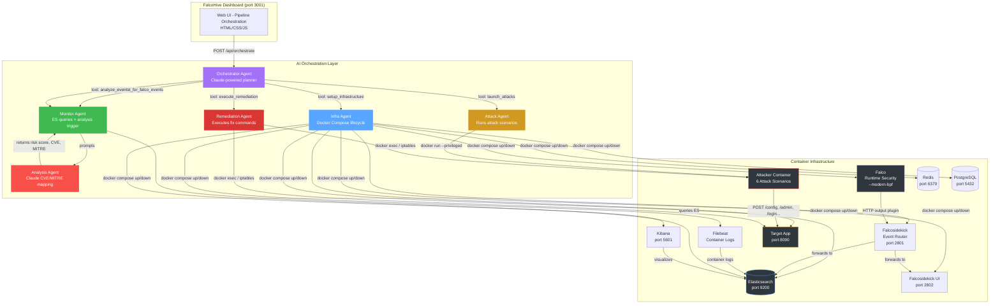

# FalcoHive — Technical Documentation

**Date:** May 25, 2026
**Author:** Ritvik Indupuru

---

## Table of Contents

1. [System Architecture](#1-system-architecture)
   - 1.1 [Architecture Diagram](#11-architecture-diagram)
   - 1.2 [Architecture Flow Description](#12-architecture-flow-description)
   - 1.3 [Network Topology](#13-network-topology)
   - 1.4 [Data Flow](#14-data-flow)
2. [Technology Stack](#2-technology-stack)
3. [Infrastructure Components](#3-infrastructure-components)
   - 3.1 [Elasticsearch](#31-elasticsearch)
   - 3.2 [Kibana](#32-kibana)
   - 3.3 [Falco — Runtime Security](#33-falco--runtime-security)
   - 3.4 [Falcosidekick — Event Router](#34-falcosidekick--event-router)
   - 3.5 [Falcosidekick UI](#35-falcosidekick-ui)
   - 3.6 [Filebeat — Container Log Shipper](#36-filebeat--container-log-shipper)
   - 3.7 [Redis](#37-redis)
   - 3.8 [PostgreSQL](#38-postgresql)
   - 3.9 [Target Application](#39-target-application)
   - 3.10 [Attacker Container](#310-attacker-container)
4. [AI Orchestration Layer](#4-ai-orchestration-layer)
   - 4.1 [FastAPI Backend (api-agent/main.py)](#41-fastapi-backend)
   - 4.2 [Orchestrator Agent](#42-orchestrator-agent)
   - 4.3 [Infra Agent](#43-infra-agent)
   - 4.4 [Attack Agent](#44-attack-agent)
   - 4.5 [Monitor Agent](#45-monitor-agent)
   - 4.6 [Analysis Agent](#46-analysis-agent)
   - 4.7 [Remediation Agent](#47-remediation-agent)
5. [Multi-Agent Pipeline Flow](#5-multi-agent-pipeline-flow)
   - 5.1 [Pipeline Trigger](#51-pipeline-trigger)
   - 5.2 [Phase 1: Setup Infrastructure](#52-phase-1-setup-infrastructure)
   - 5.3 [Phase 2: Launch Attacks](#53-phase-2-launch-attacks)
   - 5.4 [Phase 3: Wait for Falco Events](#54-phase-3-wait-for-falco-events)
   - 5.5 [Phase 4: Analyze Events](#55-phase-4-analyze-events)
   - 5.6 [Phase 5: Execute Remediation](#56-phase-5-execute-remediation)
   - 5.7 [Phase 6: Report Final Status](#57-phase-6-report-final-status)
   - 5.8 [Session Management & Logging](#58-session-management--logging)
6. [Attack Scenarios](#6-attack-scenarios)
   - 6.1 [Cgroup notify_on_release Escape (CVE-2022-0492)](#61-cgroup-notify_on_release-escape-cve-2022-0492)
   - 6.2 [OverlayFS Whiteout Tampering (CVE-2021-31433)](#62-overlayfs-whiteout-tampering-cve-2021-31433)
   - 6.3 [io_uring Seccomp Bypass (CVE-2022-25362)](#63-io_uring-seccomp-bypass-cve-2022-25362)
   - 6.4 [ARP Cache Poisoning MITM (T1557)](#64-arp-cache-poisoning-mitm-t1557)
   - 6.5 [eBPF Rootkit Load Attempt (T1562)](#65-ebpf-rootkit-load-attempt-t1562)
   - 6.6 [Userfaultfd Race Condition (CVE-2022-2588)](#66-userfaultfd-race-condition-cve-2022-2588)
7. [Target Application](#7-target-application)
   - 7.1 [Service Cards](#71-service-cards)
   - 7.2 [Attack Impact Visualization](#72-attack-impact-visualization)
   - 7.3 [Real-Time Modal Updates](#73-real-time-modal-updates)
   - 7.4 [API Endpoints](#74-api-endpoints)
   - 7.5 [Mock Data & Stolen Data Models](#75-mock-data--stolen-data-models)
8. [Dashboard Frontend](#8-dashboard-frontend)
   - 8.1 [Pipeline Visualization](#81-pipeline-visualization)
   - 8.2 [Falco Security Events Panel](#82-falco-security-events-panel)
   - 8.3 [AI Analysis Panel](#83-ai-analysis-panel)
   - 8.4 [Remediation Execution](#84-remediation-execution)
   - 8.5 [Quick Access Toolbar](#85-quick-access-toolbar)
   - 8.6 [Session Management](#86-session-management)
9. [Falco Custom Rules](#9-falco-custom-rules)
10. [Configuration Reference](#10-configuration-reference)
11. [Deployment Guide](#11-deployment-guide)
12. [Data Indexes & Schema](#12-data-indexes--schema)
13. [Security Considerations](#13-security-considerations)
14. [Conclusion](#14-conclusion)

---

## Executive Summary

FalcoHive is an AI-powered container security attack laboratory that orchestrates a complete security workflow: infrastructure provisioning, real attack execution, runtime syscall detection via Falco, AI-driven analysis through Claude, and automated remediation. The system simulates six distinct container security attack scenarios against a mock enterprise application ("TargetCorp Internal Portal"), detects them using Falco's kernel-level monitoring (modern BPF probe on supported kernels), enriches them with Claude AI for CVE/MITRE ATT&CK mapping and risk scoring, and provides one-click remediation execution.

The platform is structured as a multi-agent AI orchestration layer (Python/FastAPI) that controls a Docker Compose-based infrastructure stack including Elasticsearch, Kibana, Redis, PostgreSQL, Falco, Falcosidekick, Filebeat, a target application, and an attacker container. A single-click "Run Full Pipeline" button on the dashboard triggers the entire workflow: the Claude-powered Orchestrator Agent plans and delegates tasks to five sub-agents (Infra, Attack, Monitor, Analysis, Remediation) via function calling, executing up to 30 sequential tool calls to complete the pipeline.

The target application provides real-time visual feedback — six service cards transition from green (healthy) to yellow (probing) to red (compromised) with staggered animations as each attack progresses, with clickable modals showing both healthy UIs and compromised interfaces with stolen data highlighted. The system targets Ubuntu Linux VMs with Falco's modern BPF probe for real syscall detection, with all events, analyses, remediations, and orchestration logs persisted in Elasticsearch for exploration through Kibana.
## 1. System Architecture

### 1.1 Architecture Diagram

<p align="center">
  <strong>Figure 1: FalcoHive System Architecture</strong>
</p>



### 1.2 Architecture Flow Description

The system operates as a layered architecture with three primary tiers:

**Tier 1 — Dashboard & API Layer:** The user interacts with a single-page web application served by FastAPI on port 3001 (configurable via `AI_AGENT_PORT`). The dashboard provides pipeline orchestration controls, real-time status updates, and access to all underlying services. The FastAPI backend exposes REST endpoints for event retrieval, AI analysis, remediation execution, session management, and pipeline orchestration. All API responses are JSON, with the root endpoint serving the static HTML frontend.

**Tier 2 — AI Orchestration Layer:** Six Python agent classes form the orchestration brain. The Orchestrator Agent (Claude Sonnet 4) receives a high-level goal, plans a sequence of tool calls, and delegates execution to sub-agents. Each sub-agent has a specific responsibility:
- Infra Agent manages Docker Compose lifecycle
- Attack Agent builds and runs the attacker container
- Monitor Agent polls Elasticsearch and coordinates analysis
- Analysis Agent calls Claude for CVE/MITRE mapping
- Remediation Agent executes fix commands

The Orchestrator runs in a loop (up to 30 iterations), calling one tool per iteration, until the pipeline is complete. Each tool result is fed back to Claude for the next decision.

**Tier 3 — Container Infrastructure:** Eleven Docker services compose the runtime environment. Elasticsearch is the central data store for all events, analyses, and remediations. Falco (with `--modern-bpf` flag on supported kernels) performs real-time syscall monitoring. Falcosidekick routes Falco alerts to Elasticsearch and the Sidekick UI. The target application exposes HTTP endpoints that the attacker container targets with six distinct security attack scenarios. Redis supports Falcosidekick UI's event caching. PostgreSQL is the mock database target. Filebeat ships container logs to Elasticsearch.

### 1.3 Network Topology

All services are connected through a single Docker bridge network (`unique-net`, subnet `172.21.0.0/16`). Inter-service communication uses Docker's internal DNS resolution via container names:
- `http://elasticsearch:9200` for ES access
- `http://falcosidekick:2801` for Falco event routing
- `http://unique-target:8080` for the attacker's target
- `http://kibana:5601` for Kibana readiness checks
- `unique-redis:6379` for Redis connections

The ai-agent container mounts the Docker socket (`/var/run/docker.sock`) for running Docker and Docker Compose commands from within the container. It also mounts the project root at `/workspace:ro` for access to `docker-compose.yml`.

### 1.4 Data Flow

The complete data flow through the system follows this sequence:

1. **User Action:** Click "Run Full Pipeline" → `POST /api/orchestrate` → background task starts
2. **Orchestration:** Orchestrator Agent receives goal → plans tool sequence → calls tools one at a time
3. **Infrastructure:** Infra Agent runs `docker compose up -d` for all services → waits for ES/Kibana readiness
4. **Event Generation:** Attack Agent builds and runs attacker container → attacker hits target app endpoints → Falco detects syscalls → Falcosidekick forwards alerts to ES
5. **Event Detection:** Monitor Agent polls ES `falco-events-*` index until events appear
6. **AI Analysis:** Monitor Agent fetches events → passes each to Analysis Agent → Analysis Agent calls Claude → structured JSON returned with CVE/MITRE/risk → indexed into `ai-attack-analysis`
7. **Remediation:** Orchestrator calls Remediation Agent → executes Docker commands on infrastructure → results indexed into `ai-remediation-actions`
8. **Visualization:** Dashboard polls `/api/events`, `/api/analyses`, `/api/orchestrate/{id}` → renders live updates

---

## 2. Technology Stack

| Layer | Technology | Version | Purpose |
|-------|-----------|---------|---------|
| Runtime Security | Falco | 0.36.1 | Kernel-level syscall monitoring via modern BPF probe |
| Event Routing | Falcosidekick | 2.28.0 | Receives Falco output, forwards to Elasticsearch |
| Event Visualization | Falcosidekick UI | 2.2.0 | Real-time web interface for Falco alerts |
| Storage & Search | Elasticsearch | 8.11.0 | Central data store for events, analyses, remediations |
| Data Visualization | Kibana | 8.11.0 | Ad-hoc data exploration and dashboarding |
| Container Logs | Filebeat | 8.11.0 | Ships Docker container logs to Elasticsearch |
| AI Orchestration | Anthropic Claude Sonnet 4 | `claude-sonnet-4-20250514` | Planning, analysis, and remediation intelligence |
| Backend API | Python + FastAPI | 3.12 / latest | REST API server with async endpoints |
| Frontend | Vanilla HTML/CSS/JS | — | Single-page dashboard with dark theme |
| Container Runtime | Docker + Docker Compose v2 | latest | Container orchestration and lifecycle |
| Target Application | Python http.server | 3.12 | Mock enterprise app with live attack visualization |
| Attack Engine | Python (scapy, ctypes, subprocess) | 3.12 | Six distinct security attack scenarios |

---

## 3. Infrastructure Components

### 3.1 Elasticsearch

Elasticsearch 8.11.0 serves as the system's central data store. It runs as a single-node cluster (`discovery.type=single-node`) with security disabled (`xpack.security.enabled=false`) for lab purposes. JVM heap is limited to 512MB. Data persists across container restarts via a named Docker volume (`es_data`).

**Indexes created by the system:**

| Index | Purpose | Documents |
|-------|---------|-----------|
| `falco-events-*` | Falco security alerts (date-based rollover) | Raw Falco event JSON (rule, priority, output, output_fields, time) |
| `ai-attack-analysis` | AI analysis results | attack_name, description, cve_mapping, mitre_attack, risk_score, risk_explanation, remediation_steps, original_event, analyzed_at |
| `ai-remediation-actions` | Remediation execution records | analysis_id, step_index, step_title, result (executed, output, effectiveness), executed_at |
| `ai-orchestration-sessions` | Orchestration pipeline logs | session_id, event_type, agent, data, goal, timestamp |

The ai-agent creates these indexes at startup via the FastAPI lifespan handler. If Elasticsearch is unavailable at startup, the creation is deferred (wrapped in try/except) and the indexes will be created on first write.

**Elasticsearch is accessed by:**
- `monitor_agent.py` — polls for Falco events, retrieves analysis summaries
- `orchestrator_agent.py` — retrieves analysis documents for remediation
- `main.py` API endpoints — `/api/events`, `/api/analyses`, `/api/remediations`, `/api/clear`
- `analysis_agent.py` — indexes analysis results
- Falcosidekick — forwards Falco alerts via HTTP API

### 3.2 Kibana

Kibana 8.11.0 runs alongside Elasticsearch for ad-hoc data exploration. It is configured to connect to `http://elasticsearch:9200`. Users can create data views for `falco-events-*`, `ai-attack-analysis`, and `ai-remediation-actions` to explore raw data, create visualizations, and build dashboards. The Infra Agent waits for Kibana's `/api/status` endpoint to return HTTP 200 before considering infrastructure setup complete.

### 3.3 Falco — Runtime Security

Falco 0.36.1 is the runtime security engine. It runs in a privileged container with `pid: host` and mounts `/proc`, `/etc`, and `/var/run/docker.sock` from the host for syscall monitoring and container introspection.

**Driver Configuration:**

The system uses `--modern-bpf` flag which enables the modern BPF probe (CO-RE — Compile Once, Run Everywhere). This requires:
- Linux kernel 5.19+ with BPF Type Format (BTF) support
- `CONFIG_BPF` and `CONFIG_DEBUG_INFO_BTF` enabled in the kernel
- The `CAP_BPF`, `CAP_TRACING`, and `CAP_PERFMON` capabilities

On kernel versions that don't support modern BPF, Falco falls back to the kernel module or legacy eBPF probe via the driver loader.

**Falco Configuration (`falco.yaml`):**
- JSON output enabled for both stdout and HTTP output
- HTTP output plugin sends events to Falcosidekick at `http://falcosidekick:2801/` with keepalive
- File output writes to `/var/log/falco.log` at info priority
- Custom rules loaded from `/etc/falco/rules.d/`
- System rules loaded from `/etc/falco/falco_rules.yaml`
- Syscall event drop threshold set at 0.1 with logging action
- Buffer size preset at level 5 for high-throughput environments

**Behavior when syscall monitoring is unavailable:**

If the host kernel does not support the `--modern-bpf` driver (e.g., WSL2, Docker Desktop, or kernels without BTF), Falco starts in a degraded state without syscall detection. In this mode, no events are generated from syscall monitoring, but the Falcosidekick event routing pipeline and all other services remain operational. The system can still receive Falco events from other sources (plugins, file intake) but real container security event detection requires a Linux host with a compatible kernel.

### 3.4 Falcosidekick — Event Router

Falcosidekick 2.28.0 receives Falco security alerts via HTTP and routes them to configured outputs. It listens on port 2801. The custom configuration (`falcosidekick/config.yaml`) enables the Elasticsearch output, forwarding all received events to `http://elasticsearch:9200` with the index pattern `falco-events`. It also has the WebUI output enabled, pointing to `http://unique-falcosidekick-ui:2802`.

### 3.5 Falcosidekick UI

Falcosidekick UI 2.2.0 provides a real-time web interface for viewing Falco alerts at port 2802. It uses Redis (`unique-redis:6379`) for event caching and has authentication disabled for the lab environment.

### 3.6 Filebeat — Container Log Shipper

Filebeat 8.11.0 collects Docker container logs and ships them to Elasticsearch. It runs as root, mounts `/var/lib/docker/containers` for log file access and `/var/run/docker.sock` for container metadata. Strict permission checks are disabled (`--strict.perms=false`) to avoid permission issues with the mounted volumes.

### 3.7 Redis

Redis Stack Server 7.2.0-v11 serves as the event cache backend for Falcosidekick UI. It is a lightweight, ephemeral store — no persistent volume is mounted, meaning data is lost on container restart. It runs on port 6379 on the internal network.

### 3.8 PostgreSQL

PostgreSQL 15 is included as a mock database target for the attack scenarios. It is pre-configured with:
- Database: `safedb`
- User: `safeuser`
- Password: `safepass`

These credentials are intentionally weak and are exposed/leaked by the Cgroup Escape attack scenario. In a real environment, these would correspond to actual production database secrets.

### 3.9 Target Application

The target application is a custom Python HTTP server (`target/server.py`) built on `http.server.BaseHTTPRequestHandler`. It serves two purposes:

**Visual Mock Enterprise Application:** A single-page web application ("TargetCorp Internal Portal") with six service cards that visually show attack impact in real-time. Each card represents a different service:
- Database Config (PostgreSQL connection panel)
- Admin Portal (RBAC control panel)
- User Login (JWT authentication form)
- Internal API (REST API explorer)
- File Upload (secure upload portal)
- System Health (operational dashboard)

**Attacker Target:** HTTP endpoints that the attacker container hits with attack-specific payloads. The server tracks all requests, updates component states, and maintains an attack timeline.

Key features include:
- Auto-refresh every 1.5 seconds via `setInterval(refresh, 1500)`
- Staggered card transitions (1200ms delay between each status change)
- Clickable service cards showing healthy or compromised modals
- Real-time modal updates when left open during attacks
- Attack timeline feed showing PROBE → EXPLOIT → VERIFY phases
- Dynamic header banner switching between OPERATIONAL, UNDER ATTACK, and COMPROMISED
- Request log table with CVE/MITRE tags and phase badges
- State management via `POST /api/reset` for clean pipeline runs

### 3.10 Attacker Container

The attacker container runs six sequential attack scenarios against the target application. It is built from `attacker/Dockerfile` and runs with extensive Linux capabilities:
- `SYS_ADMIN` for namespace operations and cgroup manipulation
- `NET_ADMIN` for ARP spoofing and network manipulation
- `SYS_PTRACE` for process introspection
- `SYS_RAWIO` for raw I/O operations
- `BPF` for eBPF program loading
- `SYS_MODULE` for kernel module operations
- `DAC_READ_SEARCH` for bypassing file permission checks

The container also mounts `/var/run/docker.sock` for Docker API access and runs in privileged mode for full system access.

**Execution Flow (entrypoint.py):**

The `main()` function performs these steps:
1. Wait 5 seconds for infrastructure readiness
2. `POST /api/reset` to clear target state
3. For each of 6 attacks:
   a. Log attack metadata (name, CVE, MITRE, endpoints, impact)
   b. Send pre-exploit probe HTTP requests to all target endpoints
   c. Import and execute the attack module
   d. Send exploitation notification to target
   e. Send post-exploit verification HTTP requests
   f. Log completion
4. Each attack is separated by a 5-second delay (`ATTACK_DELAY = 5`)

The attacker communicates with the target application via HTTP through Docker's internal DNS (`http://unique-target:8080`).

---

## 4. AI Orchestration Layer

### 4.1 FastAPI Backend (main.py)

The FastAPI application (`ai-agent/app/main.py`) on port 3000 (mapped to host port 3001) serves as the central API gateway. It instantiates all agent classes as module-level singletons and wires them together into the orchestrator.

**Application Lifespan:**
At startup, the `lifespan` handler attempts to create three Elasticsearch indexes (`ai-attack-analysis`, `ai-remediation-actions`, `ai-orchestration-sessions`) if they don't exist. If Elasticsearch is unavailable, the creation is gracefully deferred via a try/except wrapper.

**API Endpoints:**

| Endpoint | Method | Purpose |
|----------|--------|---------|
| `/` | GET | Serve dashboard HTML |
| `/api/events` | GET | Fetch latest 50 Falco events from ES |
| `/api/analyses` | GET | Fetch latest 50 AI analyses from ES |
| `/api/remediations` | GET | Fetch latest 50 remediation records from ES |
| `/api/analyze` | POST | Analyze a single event (by ID) or all events (`analyze_all: true`) via batch |
| `/api/remediate` | POST | Execute a specific remediation step by analysis_id and step_index |
| `/api/orchestrate` | POST | Start the full pipeline orchestration as a background task |
| `/api/orchestrate/sessions` | GET | List all active orchestration sessions |
| `/api/orchestrate/{session_id}` | GET | Get detailed status of a specific orchestration session |
| `/api/clear` | DELETE | Clear all data: ES indices + Redis keys, reset in-memory sessions |

**Request Models:**
- `AnalyzeRequest`: `event_id` (optional, string), `analyze_all` (optional, boolean)
- `RemediateRequest`: `analysis_id` (required, string), `step_index` (required, integer)
- `OrchestrateRequest`: `goal` (optional, string with default pipeline goal), `run_id` (optional, string)

**Static Files:** The `/static` mount serves the frontend assets (index.html, app.js, style.css) from `ai-agent/app/static/`.

### 4.2 Orchestrator Agent

The Orchestrator Agent (`orchestrator_agent.py`) is the system's autonomous planner and executor. It uses Anthropic's Claude Sonnet 4 (`AsyncAnthropic`) with predefined tool definitions.

**Initialization:**
```python
OrchestratorAgent(api_key, model, infra_agent, attack_agent, monitor_agent, analysis_agent, remediation_agent)
```

It receives references to all five sub-agents and maintains no other state — all session data is managed by `main.py`'s `orchestration_sessions` dictionary.

**Tool Definitions:**

The agent registers seven tools with Claude via function calling:

| Tool Name | Purpose | Input Schema |
|-----------|---------|--------------|
| `setup_infrastructure` | Start all Docker services and wait for readiness | `services` (array of strings, optional) |
| `launch_attacks` | Build and run the attacker container | None |
| `wait_for_falco_events` | Poll ES for Falco events | `timeout_seconds` (number, default 120), `min_events` (number, default 1) |
| `analyze_events` | Run AI analysis on all detected events | `analyze_all` (boolean, optional) |
| `execute_remediation` | Execute a remediation step | `analysis_id` (string), `step_index` (number) |
| `check_system_status` | Check all service statuses | None |
| `get_analysis_results` | Get AI analysis summaries | None |

**Execution Loop:**

The `run()` method implements a conversational loop:
1. Send the system prompt with the workflow instructions (the goal string)
2. Receive Claude's response — either text (thought/plan) or a tool_use block
3. If tool_use: execute the tool via `_execute_tool()`, append the result to messages, continue
4. If text-only (no tool call): consider the pipeline complete, return final session
5. Maximum 30 iterations to prevent runaway AI loops
6. On error: log the failure, set session status to "failed", return

**System Prompt:**

The prompt instructs Claude to follow a strict 7-step workflow:
1. setup_infrastructure → 2. launch_attacks → 3. wait_for_falco_events → 4. analyze_events → 5. get_analysis_results → 6. execute_remediation → 7. check_system_status

Each step is constrained to call ONE tool at a time and wait for the result before proceeding.

### 4.3 Infra Agent

The Infra Agent (`infra_agent.py`) manages Docker Compose lifecycle operations from within the ai-agent container. It uses `asyncio.create_subprocess_exec` to shell out to the Docker CLI, which connects to the host's Docker daemon through the mounted socket.

**Key Methods:**

| Method | Purpose | Timeout |
|--------|---------|---------|
| `build_all()` | Run `docker compose build` | 180s |
| `start_services(services)` | Run `docker compose up -d <services>` | 180s |
| `stop_all()` | Run `docker compose down --timeout 15` | 180s |
| `check_service(name)` | Check container status via `docker ps --filter name=unique-{name}` | 60s |
| `check_all_services()` | Check all 9 infrastructure services | 60s each |
| `wait_for_service(name, timeout)` | Poll until service is running | Configurable (default 60s) |
| `wait_for_elasticsearch(timeout)` | Curl ES health endpoint until HTTP 200 | 120s |
| `wait_for_kibana(timeout)` | Curl Kibana status endpoint until HTTP 200 | 60s |

**Service Dependencies:**

When `start_services()` is called with no arguments, it starts a predefined list of 8 services: Elasticsearch, Kibana, Falco, Falcosidekick, Falcosidekick UI, Redis, PostgreSQL, and Target App. The Compose file path is hardcoded to `/workspace/docker-compose.yml` (mounted from the project root at container runtime).

**Readiness Checks:**

After starting services, the Infra Agent performs two blocking readiness checks with exponential polling:
- Elasticsearch: curls `http://elasticsearch:9200/_cluster/health` every 2 seconds, up to 120 seconds
- Kibana: curls `http://kibana:5601/api/status` every 2 seconds, up to 60 seconds

Both checks must pass before the orchestrator proceeds to the next phase.

### 4.4 Attack Agent

The Attack Agent (`attack_agent.py`) manages the attacker container's lifecycle. It uses the Docker CLI through subprocess to build and run the attacker.

**Key Methods:**

| Method | Purpose | Timeout |
|--------|---------|---------|
| `build_attacker()` | Check if `attacker:latest` image exists, skip if already built | 300s |
| `run_all()` | Remove any leftover attacker container, then `docker run --rm --privileged` with full capabilities | 300s |

**Container Configuration for Attack Runs:**

The attacker container is launched with:
- `--rm`: Auto-remove on exit
- `--privileged`: Full container privileges
- Capabilities: SYS_ADMIN, NET_ADMIN, SYS_PTRACE, SYS_RAWIO, BPF, SYS_MODULE, DAC_READ_SEARCH
- Mount: `/var/run/docker.sock` for Docker access
- Network: `unique-net` for target connectivity

**Output Processing:**

The `run_all()` method filters the attacker's stdout for lines matching attack-related keywords ("attack", "escape", "spoof", "rootkit", "bypass", "exploit", "tamper", "triggered", "simulated", "event") and returns the last 10 matching lines as a summary. The full output (last 2000 characters) and stderr (last 500 characters) are included in the result.

### 4.5 Monitor Agent

The Monitor Agent (`monitor_agent.py`) handles Elasticsearch queries and coordinates AI analysis. It maintains its own Elasticsearch client instance.

**Key Methods:**

| Method | Purpose |
|--------|---------|
| `check_elasticsearch()` | Get cluster health (status, nodes, indices count) |
| `get_falco_events(size=50)` | Fetch latest Falco events sorted by time descending |
| `wait_for_events(timeout, min_events)` | Poll ES every 3 seconds until event threshold met |
| `analyze_all_events(analyzer)` | Fetch all events, analyze each with concurrency control (semaphore=5) |
| `get_analysis_summary()` | Fetch AI analysis results with risk scores |
| `check_system_status()` | Combined check: ES health + containers + Falco events + analyses |

**Analysis Batching:**

The `analyze_all_events()` method fetches up to 50 events from ES, then uses `asyncio.gather` with a `Semaphore(5)` to limit concurrent Claude API calls to 5. Each event is analyzed through the Analysis Agent and the result is indexed back to ES immediately. The method returns counts of successful analyses and any errors.

**Event Wait Loop:**

The `wait_for_events()` method polls Elasticsearch every 3 seconds, recording each attempt's event count. It returns as soon as the minimum event threshold is met, or after the timeout with whatever events were found. The poll history is included in the response for diagnostic purposes.

### 4.6 Analysis Agent

The Analysis Agent (`analysis_agent.py`) transforms raw Falco events into structured security intelligence using Claude AI, with a rule-based fallback when the API is unavailable.

**Primary Analysis (Claude):**

The agent sends a structured prompt (`ANALYSIS_PROMPT`) containing the Falco event data (rule, priority, time, output, output_fields). Claude is instructed to return a strict JSON schema:

```json
{
  "attack_name": "string",
  "description": "string",
  "cve_mapping": ["CVE-YYYY-NNNNN"],
  "mitre_attack": ["TXXXX"],
  "affected_infrastructure": ["container runtime", "host OS"],
  "risk_score": 1-10,
  "risk_explanation": "string",
  "remediation_steps": [
    {"title": "string", "command": "string", "description": "string"}
  ]
}
```

The response is parsed from Claude's output, with cleanup for markdown code fences and `json` language tags.

**Fallback Analysis (Rule-Based):**

When Claude is unavailable (no API key) or the API call fails, the agent falls back to pattern matching:

- CVE Mapping: Predefined dictionary maps rule substrings to CVE IDs (Cgroup Release Agent → CVE-2022-0492, Overlay Whiteout → CVE-2021-31433, io_uring → CVE-2022-25362, Userfaultfd → CVE-2022-2588)
- MITRE Mapping: Same approach for MITRE ATT&CK technique IDs (T1611, T1564, T1562, T1557, T1574, T1055)
- Risk Scoring: Maps Falco priority levels to numeric scores (Critical=9, Alert=7, Error=5, Warning=4, Notice=3, Info=1)
- Remediation Steps: Predefined commands for each attack type covering Docker exec commands, iptables rules, sysctl settings, and kernel parameter checks

**Enrichment:**

Every analysis result is enriched with the original event data (`original_event`) and a timestamp (`analyzed_at`) before being returned and indexed.

### 4.7 Remediation Agent

The Remediation Agent (`remediation_agent.py`) executes remediation commands against the infrastructure. It uses Claude for AI-assisted execution analysis, with direct command execution as a fallback.

**AI-Assisted Execution:**

When Claude is available, the agent sends a `REMEDIATION_PROMPT` containing:
- Attack context (the original Falco event JSON)
- Remediation step details (title, command, description)

Claude returns a JSON with:
```json
{
  "executed": true/false,
  "output": "command output",
  "effectiveness": "high/medium/low",
  "notes": "additional information"
}
```

**Direct Command Execution:**

When Claude is unavailable or the API call fails, the agent executes the command directly via `asyncio.create_subprocess_shell`:
- Docker commands run with a 15-second timeout
- `echo` and informational commands are skipped (returned as not executed)
- Non-Docker commands (e.g., iptables, sysctl) are reported as requiring manual execution
- Output and exit codes are captured and returned in the result object

**Result Storage:**

Each remediation execution is recorded with: analysis_id, step_index, step_title, execution result, and timestamp. Results are indexed into `ai-remediation-actions` in Elasticsearch.

---

## 5. Multi-Agent Pipeline Flow

### 5.1 Pipeline Trigger

The pipeline is triggered by `POST /api/orchestrate` with an optional `goal` string (default: "Set up the full container security lab..."). The endpoint generates a unique session ID (8-character UUID prefix) and creates an in-memory session object:

```python
session = {
    "id": session_id,
    "status": "running",
    "phase": "initializing",
    "goal": goal,
    "logs": [],
    "started_at": datetime.now(timezone.utc).isoformat(),
    "completed_at": None,
    "results": {},
}
```

The session is stored in `main.py`'s `orchestration_sessions` dictionary and a background task (`run_orchestration_pipeline`) is started immediately. The endpoint returns immediately with the session ID for the dashboard to poll.

### 5.2 Phase 1: Setup Infrastructure

The orchestrator calls `setup_infrastructure` tool:

1. **Pre-check:** Monitor Agent checks current container status (how many services are already `Up`)
2. **Build:** Skipped — images are pre-built by `run.sh`
3. **Start:** Infra Agent runs `docker compose up -d` for all 8 services (ES, Kibana, Falco, Falcosidekick, Sidekick UI, Redis, PostgreSQL, Target App)
4. **Wait for ES:** Infra Agent polls ES cluster health endpoint (HTTP 200) every 2 seconds, up to 120 seconds
5. **Wait for Kibana:** Infra Agent polls Kibana status endpoint (HTTP 200) every 2 seconds, up to 60 seconds
6. **Return:** Summary with ES and Kibana readiness status

### 5.3 Phase 2: Launch Attacks

The orchestrator calls `launch_attacks` tool:

1. **Build:** Attack Agent checks if `attacker:latest` image exists — skips build if present
2. **Run:** Attack Agent removes any leftover attacker container, then runs `docker run --rm --privileged` with full capabilities, connected to `unique-net`
3. **The attacker entrypoint:**
   a. Waits 5 seconds for target readiness
   b. Resets target state via `POST /api/reset`
   c. Executes 6 attacks sequentially, each with 5-second delay
   d. For each attack: sends PROBE → runs exploit module → sends EXPLOIT → sends VERIFY notifications to target
4. **Return:** Summary with exit code, key attack log lines, and truncated full output

### 5.4 Phase 3: Wait for Falco Events

The orchestrator calls `wait_for_falco_events` tool:

1. Monitor Agent polls `falco-events-*` index every 3 seconds
2. Records each poll attempt's event count for diagnostics
3. Returns as soon as event count >= minimum (default 1)
4. If timeout (default 120s), returns with whatever events were found
5. Includes event summary (rule names of first 10 events)

### 5.5 Phase 4: Analyze Events

The orchestrator calls `analyze_events` tool:

1. Monitor Agent fetches all Falco events from ES (up to 50)
2. Each event is passed to Analysis Agent for Claude-powered analysis
3. Concurrency limited to 5 simultaneous Claude API calls via `asyncio.Semaphore`
4. Each analysis result is immediately indexed into `ai-attack-analysis`
5. Returns count of successful analyses and any errors

### 5.6 Phase 5: Execute Remediation

The orchestrator may call `execute_remediation` tool:

1. Retrieves the analysis document from ES by `analysis_id`
2. Validates the `step_index` against available remediation steps
3. Executes the remediation step command via Remediation Agent
4. Records the execution result in `ai-remediation-actions`
5. Returns execution summary (success/failure with output)

### 5.7 Phase 6: Report Final Status

The orchestrator may call `check_system_status` to report final results:

1. ES cluster health (status, nodes, indices)
2. All running containers with their status
3. Total Falco event count
4. Total analysis count
5. Returns combined summary

### 5.8 Session Management & Logging

Throughout the pipeline, the `on_event` callback in `run_orchestration_pipeline` handles four event types:

| Event Type | Trigger | Action |
|-----------|---------|--------|
| `phase` | Agent phase change | Updates `session["phase"]` for dashboard polling |
| `thought` | Claude's text output | Logged but doesn't change session state |
| `tool_start` | Tool invocation begins | Logs the tool name and input parameters |
| `tool_end` | Tool execution completes | Logs the result (truncated to 200 chars) |
| `error` | Agent or system error | Logged immediately as error level |
| `complete` | Pipeline finished | Sets session status to complete, records completion time |

All events are also mirrored to the `ai-orchestration-sessions` Elasticsearch index for persistence. The dashboard polls `/api/orchestrate/{session_id}` every few seconds to display the latest logs, phase, and status to the user.

---

## 6. Attack Scenarios

### 6.1 Cgroup notify_on_release Escape (CVE-2022-0492)

**Target:** Target app `/config` endpoint
**CVE:** CVE-2022-0492 (Linux kernel cgroup v1 notify_on_release container escape)
**MITRE ATT&CK:** T1611 (Escape to Host)

**Description:** This attack exploits a design flaw in the cgroup v1 `notify_on_release` mechanism. When a cgroup is emptied of processes, the kernel invokes a configured `release_agent` binary. If an attacker can write to the `release_agent` file (which points to the binary to execute), they can escape the container by:
1. Writing a malicious script path to `release_agent`
2. Creating the malicious script
3. Emptying the cgroup, triggering execution on the host

**Implementation (`cgroup_escape.py`):**
- Mounts the cgroup filesystem inside the container (read-write)
- Creates a child cgroup
- Writes a malicious script to a known path
- Sets `release_agent` to point to the script
- Echoes the PID of the script to `cgroup.procs`, triggering the notify_on_release handler
- On systems without cgroup v1 write access, falls back to reading `/proc/1/root` for host filesystem access

**Target App Impact:** Credentials exposed — Database host, port, user, password, and secret key stolen from the target app's `/config` endpoint.

### 6.2 OverlayFS Whiteout Tampering (CVE-2021-31433)

**Target:** Target app `/internal` endpoint
**CVE:** CVE-2021-31433 (OverlayFS whiteout file atomic open bypass)
**MITRE ATT&CK:** T1564 (Hide Artifacts)

**Description:** This attack abuses overlayfs whiteout files (`.wh.*`) which are used by OverlayFS to mark files as deleted in a merged view. By creating whiteout files with crafted names:
1. `.wh.malware_payload` hides the file `malware_payload` from the overlay's merged view
2. Files with `.wh.` prefix are invisible to standard directory listing within the container
3. The technique enables persistent file hiding across container restarts

**Implementation (`overlayfs_tamper.py`):**
- Creates hidden artifacts in `/tmp/upper/` with `.wh.` prefix
- Attempts to write to `/proc/1/root` for host-level persistence
- On read-only filesystems, creates whiteout files in the container's writable layer
- Verifies the hidden files are invisible to `ls`

**Target App Impact:** Data exfiltrated — Internal API data (user records, secrets, config, logs) stolen through the `/internal` endpoint.

### 6.3 io_uring Seccomp Bypass (CVE-2022-25362)

**Target:** Target app `/admin` endpoint
**CVE:** CVE-2022-25362 (io_uring syscall seccomp bypass)
**MITRE ATT&CK:** T1562 (Impair Defenses)

**Description:** io_uring is a Linux kernel interface for asynchronous I/O. It uses submission and completion queues in shared memory, avoiding standard read/write syscalls. This attack exploits the fact that seccomp filters typically only inspect system calls entering the kernel, not io_uring operations processed within the kernel's SQ polling thread. This allows:
1. Bypassing seccomp filters that restrict read/write/open but allow `io_uring_setup`
2. Performing privileged operations while appearing to respect seccomp policies

**Implementation (`iouring_bypass.py`):**
- Calls `io_uring_setup()` syscall to create an io_uring instance with submission queue polling
- Falls back to `os.system("uname -r")` if the syscall is unavailable (e.g., no CONFIG_IO_URING)
- Simulates seccomp bypass by testing syscall restrictions

**Target App Impact:** Unauthorized admin access — Seccomp filter bypassed, admin rights granted to the attacker on the target app's `/admin` endpoint.

### 6.4 ARP Cache Poisoning MITM (T1557)

**Target:** Target app `/login` endpoint
**CVE:** N/A (technique-based)
**MITRE ATT&CK:** T1557 (Man-in-the-Middle)

**Description:** ARP (Address Resolution Protocol) cache poisoning on the Docker bridge network tricks the target application into sending traffic through the attacker's container. By sending forged ARP replies, the attacker associates their MAC address with the gateway's IP, intercepting all network traffic.

**Implementation (`arp_spoof.py`):**
- Uses raw sockets (via scapy or manual packet crafting) to send forged ARP packets
- Spoofs the target's IP (`172.21.0.1` for the target) on the Docker bridge network
- Can also poison the gateway's ARP cache for bidirectional interception
- Falls back to simulation if raw socket permissions are denied

**Target App Impact:** Credentials captured — JWT tokens, passwords, and session cookies intercepted via MITM during `/login` POST requests.

### 6.5 eBPF Rootkit Load Attempt (T1562)

**Target:** Target app `/api/internal` endpoint
**CVE:** N/A (technique-based)
**MITRE ATT&CK:** T1562 (Impair Defenses)

**Description:** eBPF (extended Berkeley Packet Filter) programs run in the kernel and can hook syscalls, trace events, and inspect network packets. A malicious eBPF program can:
1. Hook `open()`, `read()`, `write()`, and `connect()` syscalls via kprobes
2. Hide files, processes, and network connections
3. Exfiltrate data read by any process
4. Maintain persistence across container restarts

**Implementation (`bpf_rootkit.py`):**
- Attempts to load eBPF programs using `bpf()` syscall callback
- Falls back to `/etc/ld.so.preload` injection for LD_PRELOAD-based syscall hooking
- Creates a shared object file that hooks libc functions
- Simulates rootkit behavior when running without root

**Target App Impact:** Internal API data exfiltrated — Customer records, API keys, and internal service routes stolen from the `/api/internal` endpoint via kernel-level data interception.

### 6.6 Userfaultfd Race Condition (CVE-2022-2588)

**Target:** Target app `/upload` endpoint
**CVE:** CVE-2022-2588 (userfaultfd race condition)
**MITRE ATT&CK:** T1574 (Hijack Execution Flow)

**Description:** Userfaultfd allows user-space handling of page faults. By registering a memory region with userfaultfd, the attacker can trap page faults and delay page resolution. Combined with a concurrent write operation, this creates a time-of-check-to-time-of-use (TOCTOU) race condition that corrupts application data.

**Implementation (`userfaultfd_exploit.py`):**
- Opens `/dev/userfaultfd` and registers for page fault handling on a mapped memory region
- Spawns concurrent threads for file writing and fault handling
- Exploits the race window between page fault and page-in to modify data
- Falls back to python simulation when the device is unavailable

**Target App Impact:** Application files corrupted — The main application file is overwritten with malicious payload during the race condition window, corrupting file integrity.

---

## 7. Target Application

### 7.1 Service Cards

The "TargetCorp Internal Portal" displays six service cards in a 3-column grid layout. Each card has three visual states:

**State: OK (Green)**
- Green accent bar at the top of the card
- Green dot badge reading "OK"
- Normal service description (e.g., "PostgreSQL 15 connected · 3 active connections · SSL encrypted")
- Functional UI in the modal (connection panel, login form, API explorer, file upload portal, or system health dashboard)

**State: Probing (Yellow)**
- Yellow accent bar with pulsing animation
- Yellow badge reading "PROBING"
- Message indicating the attacker is testing the service

**State: Compromised (Red)**
- Red accent bar with faster pulsing animation
- Red badge reading "COMPROMISED"
- Alert message showing what was stolen (e.g., "CREDENTIALS EXPOSED · Database host, port, and secret key stolen via cgroup escape")
- Compromised modal showing actual stolen data fields with exploit method

Card transitions are staggered — when multiple cards change state simultaneously, they update one at a time with a 1200ms delay between each.

### 7.2 Attack Impact Visualization

The header banner dynamically reflects overall system status:
- **OPERATIONAL** (green dot) — all cards OK
- **UNDER ATTACK** (yellow dot, text in yellow) — one or more cards probing/compromised
- **COMPROMISED** (red dot, text in red) — system card also compromised

The Attack Timeline feed shows each phase as a new entry:
```
[12:58:12] [PROBE]   Database Config   Probing endpoint /config...
[12:58:17] [EXPLOIT] Database Config   CREDENTIALS EXPOSED...
[12:58:22] [VERIFY]  Database Config   Verifying Cgroup Escape impact...
```

Entries appear one by one with no animation (append-only). The feed scrolls automatically to show the latest events.

### 7.3 Real-Time Modal Updates

When a modal is left open during an attack, it updates dynamically:
1. If the card was previously OK: the modal shows the healthy service UI
2. When the card transitions to PROBING: the modal content changes to show a spinning/searching icon with "Component is being probed — attacker scanning for vulnerabilities."
3. When the card transitions to COMPROMISED: the modal content changes to show the stolen data interface with highlighted compromised fields
4. All transitions happen automatically via the 1.5-second polling loop — the user never needs to close and reopen

### 7.4 API Endpoints

| Endpoint | Method | Purpose | Response |
|----------|--------|---------|----------|
| `/` | GET | Serve the "TargetCorp Internal Portal" HTML | HTML page |
| `/api/requests` | GET | Full application state (components, timeline, requests, stats) | JSON |
| `/api/reset` | POST | Reset all state for new pipeline run | `{"status": "reset"}` |
| `/health` | GET | Health check | `{"healthy": true}` |
| `/config` | GET/POST | Mock configuration with credentials | JSON with db_host, redis_host, secret_key |
| `/internal` | GET/POST | Mock sensitive internal data | `{"internal": "true", "sensitive": "data_here"}` |
| `/login` | POST | JWT authentication endpoint | `{"token": "fake-jwt-token-12345"}` |
| `/admin` | POST | Admin access grant | `{"admin": true, "message": "admin access granted"}` |
| `/upload` | POST | File upload | `{"uploaded": true, "size": N}` |
| `/api/internal` | POST | Internal API data | `{"api_data": "sensitive_internal_data"}` |

### 7.5 Mock Data & Stolen Data Models

The `STOLEN_DATA` dictionary defines the breach visualizations for each component:

**Database Config (Cgroup Escape):**
- Exfiltrated Fields: Database Host (`unique-postgres`), Port (`5432`), Database (`safedb`), User (`safeuser`), Password (`safepass`), Secret Key (`dev-secret-12345`)
- Response: `HTTP 200 → {"db_host": "unique-postgres", "redis_host": "unique-redis", "secret_key": "dev-secret-12345"}`
- Method: `Cgroup release_agent → read host /proc/1/root → exfiltrated /config`

**Admin Portal (io_uring Bypass):**
- Stolen: Session Token, Privilege Level (ROOT), Full admin access
- Method: `io_uring_setup() → seccomp bypass → /admin POST`

**User Login (ARP Spoof):**
- Captured: JWT token, Username (`admin`), Password (`P@ssw0rd!`), Session Cookie, Source IP
- Method: `ARP spoof → raw socket sniff → intercepted /login POST`

**Internal API (eBPF Rootkit):**
- Exfiltrated: Endpoints, Hooked syscalls, Customer records, API keys
- Method: `bpf() syscall → kprobe hook → data leak via kernel memory`

**File Upload (Userfaultfd):**
- Corrupted: Main application file, SHA256 hash mismatch, Injected payload
- Method: `userfaultfd() → page fault trap → race condition → file corruption`

---

## 8. Dashboard Frontend

### 8.1 Pipeline Visualization

The dashboard displays a 6-phase AI Orchestration Pipeline card:

| Phase | Label | Color (Pending) | Color (Running) | Color (Completed) |
|-------|-------|-----------------|-----------------|-------------------|
| 1 | Setup | Gray | Yellow (pulsing) | Green |
| 2 | Attack | Gray | Yellow (pulsing) | Green |
| 3 | Monitor | Gray | Yellow (pulsing) | Green |
| 4 | Analyze | Gray | Yellow (pulsing) | Green |
| 5 | Remediate | Gray | Yellow (pulsing) | Green |
| 6 | Complete | Gray | Yellow (pulsing) | Green |

The log panel below the pipeline card shows real-time entries from the orchestrator agent. Each entry includes a timestamp, the agent name (e.g., `[orchestrator]`, `[setup_infrastructure]`, `[launch_attacks]`), and the message content. The log auto-scrolls to show the latest entries.

### 8.2 Falco Security Events Panel

After pipeline execution, the Falco Security Events card displays each detected event with:
- **Rule name** (e.g., "Cgroup Release Agent Escape")
- **Priority** with color-coded badge (Critical=red, Alert=orange, Error=yellow, Warning=blue, Notice=gray, Info=green)
- **Timestamp**
- **Output** (truncated description)

Each event row is clickable — clicking runs instant AI analysis on that single event via `POST /api/analyze` with the event ID.

### 8.3 AI Analysis Panel

Analysis results are displayed in expandable cards showing:
- **Attack name** — What the attack is called
- **Description** — Plain-English explanation of the attack
- **Risk score** — 1-10 score with color gradient (1-3: green, 4-5: blue, 6-7: yellow, 8-10: red)
- **CVE mappings** — Red tags with CVE IDs (e.g., `CVE-2022-0492`)
- **MITRE ATT&CK mappings** — Purple tags with technique IDs (e.g., `T1611`)
- **Affected infrastructure** — What systems are impacted
- **Remediation steps** — Numbered list with title, command, description, and "Execute" button

### 8.4 Remediation Execution

Each remediation step has an "Execute" button that:
1. Posts to `POST /api/remediate` with the analysis ID and step index
2. Shows a loading state while the command runs
3. Displays the result: green "Executed successfully" with command output, or red "Failed" with error details
4. Button changes to green (executed) or red (failed) and becomes disabled

### 8.5 Quick Access Toolbar

The header contains a Quick Access toolbar with links to all services:
- **FalcoHive Dashboard** (highlighted blue — current page)
- **Falco UI** (port 2802 — real-time alert viewer)
- **Kibana** (port 5601 — data exploration)
- **Elasticsearch** (port 9200 — raw API)
- **Target App** (port 8090 — live attack visualization)

All links open in new tabs.

### 8.6 Session Management

Two primary controls are always available:
- **"Run Full Pipeline"** — Blue button in the pipeline card, triggers `POST /api/orchestrate`
- **"Clear Session"** — Red button in the header, triggers `DELETE /api/clear` with a confirmation dialog

The stats row shows after pipeline completion:
- Total Falco events detected
- AI analyses completed
- Critical risk items (risk score >= 8)
- Remediations executed

---

## 9. Falco Custom Rules

The system includes 8 custom Falco rules defined in `falco/rules/custom_rules.yaml`. These rules are in addition to Falco's default rules and target the specific attack scenarios in the lab:

| Rule Name | Macro/Condition | Priority | MITRE | Detection Target |
|-----------|----------------|----------|-------|-----------------|
| `Cgroup Release Agent Escape` | Detects write to cgroup `release_agent` file | Critical | T1611 | CVE-2022-0492 escape attempt |
| `Overlay Whiteout File Tampering` | Detects creation of `.wh.*` files | Warning | T1564 | OverlayFS hide artifacts |
| `io_uring Syscall Usage by Unexpected Program` | Detects `io_uring_setup` syscall | Notice | T1562 | Seccomp bypass attempt |
| `ARP Cache Poisoning Detection` | Detects ARP table manipulation | Alert | T1557 | MITM attack detection |
| `BPF Program Load Attempt` | Detects `bpf()` syscall for program load | Critical | T1562 | Rootkit load attempt |
| `Userfaultfd Exploitation Attempt` | Detects `userfaultfd` syscall usage | Warning | T1574 | Race condition exploit |
| `Symlink Swap Race Condition` | Detects suspicious symlink creation in shared directories | Warning | T1574 | TOCTOU file swap |
| `User Namespace Clone via unshare` | Detects `clone()` with `CLONE_NEWUSER` flag | Notice | T1611 | Container escape via namespaces |

These rules are loaded from `/etc/falco/rules.d/` and are evaluated alongside Falco's built-in rules. Coupled with `custom_rules.yaml`, the system uses JSON output format and sends all matching events to Falcosidekick for indexing.

---

## 10. Configuration Reference

| Variable | Default | Required | Description |
|----------|---------|----------|-------------|
| `COMPOSE_PROJECT_NAME` | `unique-lab` | No | Docker Compose project prefix for network/container naming |
| `ELASTIC_VERSION` | `8.11.0` | No | Elasticsearch and Kibana image version |
| `FALCO_VERSION` | `0.36.1` | No | Falco image version |
| `FALCOSIDEKICK_VERSION` | `2.28.0` | No | Falcosidekick image version |
| `CLAUDE_API_KEY` | — | **Yes** | Anthropic Claude API key (starts with `sk-ant-`) |
| `CLAUDE_MODEL` | `claude-sonnet-4-20250514` | No | Claude model identifier for analysis and orchestration |
| `ES_HOST` | `http://elasticsearch:9200` | No | Elasticsearch connection string |
| `AI_AGENT_PORT` | `3001` | No | Host port for the dashboard |

The `.env` file is gitignored and must be created from `.env.example`. The `CLAUDE_API_KEY` is the only strictly required value — without it, the Orchestrator Agent fails and the Analysis Agent falls back to rule-based analysis.

---

## 11. Deployment Guide

### System Requirements
- **Host OS:** Linux (Ubuntu 22.04 LTS recommended) with kernel 5.19+ and BTF support
- **CPU:** 2+ cores
- **RAM:** 4GB minimum (8GB recommended, Elasticsearch needs ~1GB)
- **Disk:** 20GB free space (Docker images total ~2GB)
- **Docker:** Docker Engine 24+ with Compose v2 plugin
- **Network:** Internet access for image pulls and Claude API calls

### Infrastructure Sizing

| Service | CPU | Memory | Disk |
|---------|-----|--------|------|
| Elasticsearch | 1 core | 512MB (heap) + ~256MB overhead | ~1GB for data volume |
| Kibana | 0.5 core | 256MB | Minimal |
| Falco | 1 core | 256MB | Minimal |
| Falcosidekick | 0.25 core | 128MB | Minimal |
| Redis | 0.25 core | 128MB | Minimal |
| PostgreSQL | 0.5 core | 256MB | Minimal |
| Target App | 0.25 core | 128MB | Minimal |
| AI Agent | 0.5 core | 256MB | Minimal |
| Filebeat | 0.25 core | 128MB | Minimal |
| **Total Minimum** | ~4 cores | ~2.5GB | ~2GB + data |

### Port Usage

| Port | Service | Purpose |
|------|---------|---------|
| 3001 | AI Agent Dashboard | Web UI + API (configurable via AI_AGENT_PORT) |
| 8090 | Target App | Attack visualization UI |
| 9200 | Elasticsearch | Data API |
| 5601 | Kibana | Data exploration |
| 2801 | Falcosidekick | Event HTTP intake |
| 2802 | Falcosidekick UI | Real-time alert viewer |
| 6379 | Redis | Event cache |

### Quick Start

```bash
# Clone and configure
git clone https://github.com/ritvikindupuri/falcosecurity.git
cd falcosecurity
cp .env.example .env
# Edit .env: set CLAUDE_API_KEY

# Build images and start dashboard
./run.sh

# Open http://<host-ip>:3001 in browser
# Click "Run Full Pipeline"
```

---

## 12. Data Indexes & Schema

### `falco-events-*` (raw Falco alerts)

*Note: Indexed by Falcosidekick, auto-created with date-based rollover.*

| Field | Type | Description |
|-------|------|-------------|
| `rule` | string | Falco rule name |
| `priority` | string | Priority level (Critical, Alert, Error, Warning, Notice, Info) |
| `time` | datetime | Event timestamp |
| `output` | string | Event description |
| `output_fields` | object | Raw syscall data (process, file descriptors, container ID) |
| `@timestamp` | datetime | Index timestamp |

### `ai-attack-analysis` (AI analysis results)

| Field | Type | Description |
|-------|------|-------------|
| `attack_name` | string | Short attack identifier |
| `description` | string | Plain-English attack explanation |
| `cve_mapping` | array[string] | Relevant CVE IDs |
| `mitre_attack` | array[string] | MITRE ATT&CK technique IDs |
| `affected_infrastructure` | array[string] | Impacted systems |
| `risk_score` | integer | 1-10 severity score |
| `risk_explanation` | string | Scoring rationale |
| `remediation_steps` | array[object] | Remediation actions with title, command, description |
| `original_event` | object | Raw Falco event that triggered this analysis |
| `analyzed_at` | datetime | Analysis timestamp |

### `ai-remediation-actions` (remediation execution records)

| Field | Type | Description |
|-------|------|-------------|
| `analysis_id` | string | Source analysis document ID |
| `step_index` | integer | Which remediation step was executed |
| `step_title` | string | Short step description |
| `result` | object | Execution result (executed, output, effectiveness, notes) |
| `executed_at` | datetime | Execution timestamp |

### `ai-orchestration-sessions` (pipeline logs)

| Field | Type | Description |
|-------|------|-------------|
| `session_id` | string | Unique pipeline run identifier |
| `event_type` | string | phase, thought, tool_start, tool_end, error, complete |
| `agent` | string | Agent name |
| `data` | string | Event payload |
| `goal` | string | Pipeline goal string |
| `timestamp` | datetime | Event timestamp |

---

## 13. Security Considerations

### Lab Environment Warnings

FalcoHive is a **security attack laboratory** designed for educational and testing purposes. The following important security considerations apply:

1. **Privileged Containers:** The attacker and Falco containers run with extensive Linux capabilities (SYS_ADMIN, NET_ADMIN, SYS_PTRACE, BPF, etc.) and privileged mode. This is necessary for executing real attack scenarios and syscall monitoring but would be extremely dangerous in production.

2. **Elasticsearch without Security:** Elasticsearch runs with `xpack.security.enabled=false`. This means no authentication for the data store containing all attack events, analyses, and remediation logs. In a real deployment, Elasticsearch security should be enabled.

3. **Mock Credentials:** The target application exposes intentionally weak mock credentials (`safeuser/safepass`, `dev-secret-12345`). These are simulated examples for visualizing attack impact and are not real credentials.

4. **Network Exposure:** All services expose ports on `0.0.0.0` (Docker default). If running on a cloud VM or network-accessible host, the dashboard, Kibana, Elasticsearch, and target app would be accessible to anyone who can reach the host IP. Firewall rules should restrict access to only the dashboard port (3001).

5. **Claude API Key:** The `CLAUDE_API_KEY` in `.env` is a sensitive credential transmitted to the ai-agent container. If the ai-agent container is compromised, the API key is exposed. The `.env` file is gitignored and should never be committed.

6. **Docker Socket Mount:** The ai-agent container mounts `/var/run/docker.sock`, granting it effectively root-level access to the Docker daemon. The ai-agent uses this to run Docker Compose commands and launch the attacker container. A compromised ai-agent container would have full control over the host's Docker infrastructure.

7. **Attack Execution:** Running the attacker container executes real security exploits (ARP spoofing, eBPF programs, cgroup manipulation) against the Docker bridge network and target application. While these are contained within the Docker environment, they stress the host kernel and should not be run on production systems.

### Recommended Hardening for Production Use

If adapting FalcoHive for production-like security testing:
1. Run on an isolated VM or dedicated test infrastructure
2. Enable Elasticsearch security (usernames/passwords, TLS)
3. Restrict network access with iptables/UFW to only the dashboard port
4. Use read-only root filesystems for services where possible
5. Set resource limits on all containers (Docker Compose `deploy.resources` for swarm, or `--memory`/`--cpus` limits)
6. Remove unused capabilities from non-attacker containers
7. Enable Docker Content Trust for image verification
8. Mount the project directory read-only to the ai-agent (already configured as `:ro`)

---

## 14. Conclusion

FalcoHive demonstrates a fully integrated container security workflow that combines real syscall-level monitoring (Falco with modern BPF), AI-powered analysis (Claude Sonnet 4), and automated remediation — all coordinated by a multi-agent orchestration system operating within a 30-iteration conversational loop.

The system's key architectural strengths include:

**Autonomous Pipeline Execution:** The Claude-powered Orchestrator Agent plans and executes a complex multi-step workflow without human intervention, using function calling to delegate infrastructure management, attack execution, event monitoring, AI analysis, and remediation to specialized sub-agents.

**Real Syscall Detection:** By running Falco with the `--modern-bpf` driver on a compatible Linux kernel, the system detects actual kernel-level events rather than relying on synthetic or mock data. The eight custom Falco rules target the specific attack scenarios while Falco's default rules provide broad coverage.

**Visual Attack Impact:** The target application provides immediate visual feedback through six service cards with real-time color transitions, clickable healthy/compromised modals, dynamic header state, attack timeline feed, and detailed request logging. The staggered card update animation and live modal transitions create an engaging demonstration of the attack sequence.

**Complete Data Pipeline:** Every stage of the workflow persists data to Elasticsearch — raw Falco events, AI analyses with CVE/MITRE mappings, remediation execution records, and orchestration session logs. This enables post-run analysis, Kibana exploration, and audit trail capabilities.

**Graceful Degradation:** The system handles service unavailability at multiple levels:
- Elasticsearch unavailability at startup → index creation deferred
- Claude API failure → rule-based fallback analysis with predefined CVE/MITRE/risk mappings
- Missing attack capabilities → per-attack simulation fallbacks
- Docker socket unavailability → build operations deferred to host

The result is a self-contained laboratory environment suitable for demonstrating container security concepts, testing Falco rules, evaluating AI-driven security analysis pipelines, and exploring automated remediation workflows — all through a single dashboard interface with no manual steps between pipeline trigger and final report.
